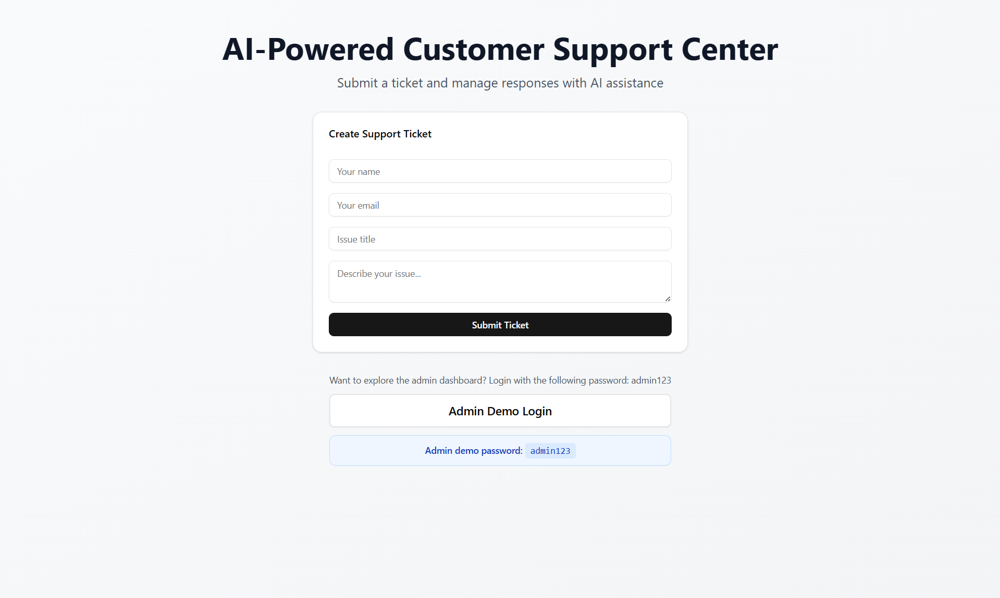
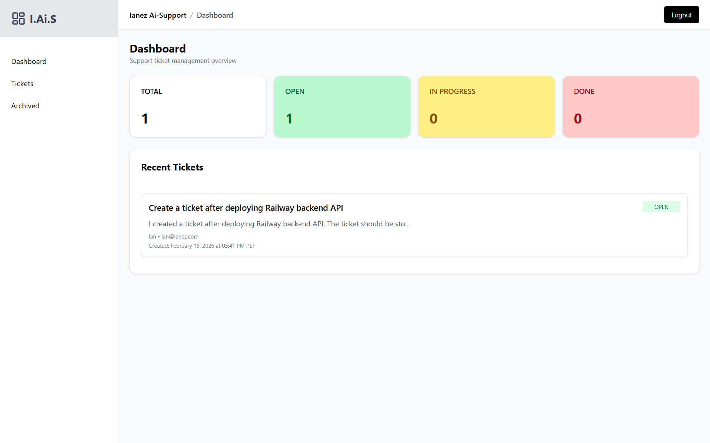
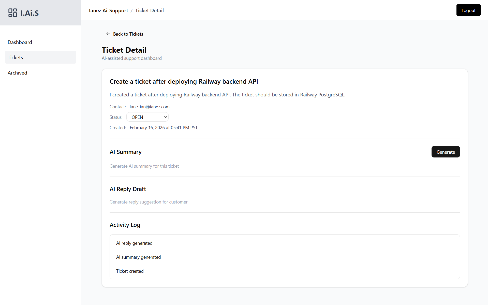
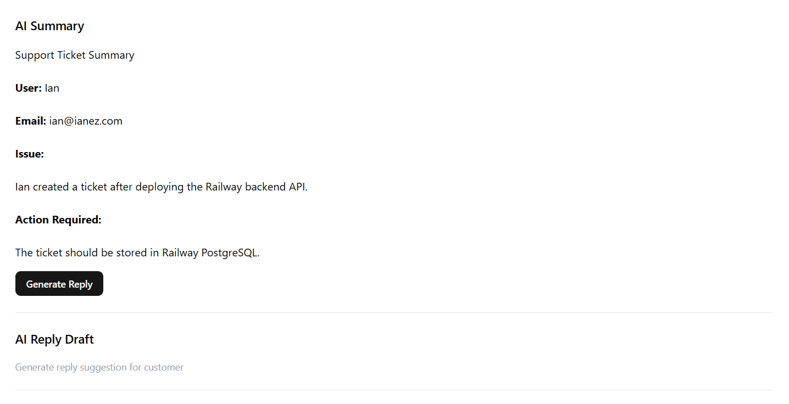
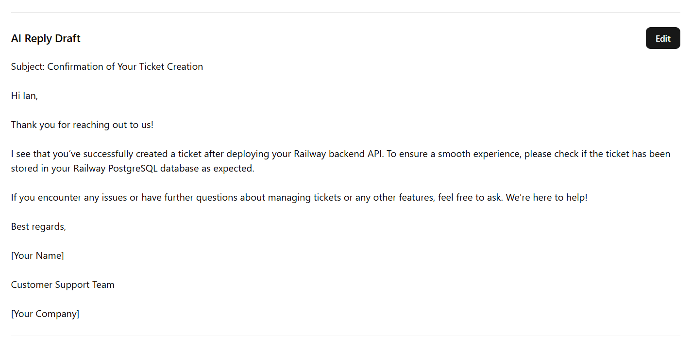

# AI Support Ticket Dashboard

Production-style AI customer support dashboard built with **Next.js + FastAPI + PostgreSQL + OpenAI**.

Designed to simulate a real internal support tool used by teams to manage tickets, generate AI replies, and track support activity.

Live Demo: https://ai-ticket-dashboard.vercel.app/

### Demo Account

Admin access uses **JWT authentication**:

**Username:** `admin`  
**Password:** `admin123`

Visit the landing page and click "Admin Demo Login" to go to the login page, then sign in with the credentials above to explore the dashboard.

---

## Tech Stack

**Frontend**

* Next.js 16 (App Router)
* TypeScript
* TailwindCSS
* shadcn/ui
* react-markdown

**Backend**

* FastAPI (Python)
* SQLAlchemy
* PostgreSQL
* OpenAI API
* JWT authentication (python-jose, passlib/bcrypt)

**Deploy**

* Vercel (frontend)
* Railway (backend)
* Railway PostgreSQL (database)

---

## Core Features

### Public Ticket Submission

Anyone can submit a support ticket from the landing page. (no login)

### Admin Dashboard

* **JWT login** (username + password → access token)
* Ticket statistics (Open / In Progress / Done)
* Recent tickets overview
* Quick navigation to ticket detail

### Ticket Management

* Status tracking workflow
* Editable ticket lifecycle
* Activity logging system
* Search + pagination ready structure

### AI Tools

* AI ticket summarization
* AI customer reply generation
* Markdown-formatted responses
* Activity logging for AI usage

---

## Architecture

```
Frontend (Next.js)
    ↓ fetch API
FastAPI backend
    ↓
PostgreSQL database
    ↓
OpenAI API
```

Clean separation between frontend UI and backend logic.

**Backend Structure:**

* **Routes**: API endpoints (`/tickets`, `/dashboard`, `/auth/login`)
* **Services**: Business logic (AI integration, logging)
* **Auth**: JWT issue/verify, password hashing, protected routes
* **Models**: Database schema (SQLAlchemy: User, Ticket, ActivityLog)
* **Config**: External service clients (OpenAI, JWT)

---

## Screenshots

### Landing page with ticket submission form
   

### Admin dashboard with statistics
   

### Ticket detail page with AI features
   
   
### AI-generated reply editor
   
   

---

## 📚 What This Project Shows

* Fullstack architecture design
* REST API design with FastAPI
* JWT-based authentication (login, protected routes)
* AI integration into real workflows
* State management across dashboard
* Production-style UI structure
* Deployable modern web stack
* Modular backend structure (routes, services, config)
* Reusable React components
* Responsive design with mobile support

---

## 🧩 Future Improvements

* Role-based access control
* WebSocket real-time updates
* Advanced search & filtering
* Ticket tagging system
* Analytics dashboard
* Multi-user admin system
* Email notifications
* File attachments

---

## Setup

**1. Frontend Setup**

```bash
cd frontend
npm install
npm run dev
```

Frontend runs on `http://localhost:3000`

**2. Backend Setup**

```bash
cd backend
python -m venv venv
source venv/bin/activate  # On Windows: venv\Scripts\activate
pip install -r requirements.txt
uvicorn app.main:app --reload
```

Backend runs on `http://localhost:8000`

**3. Database Setup**

Create PostgreSQL database and update `DATABASE_URL` in backend `.env` file.

Tables will be created automatically on first run.

**4. Backend environment variables (optional)**

For admin login to work, set in backend `.env` (and on Railway Variables for production):

* `JWT_SECRET_KEY` — A long random string used to sign JWTs (e.g. generate with `python -c "import secrets; print(secrets.token_hex(32))"`).
* `JWT_ACCESS_TOKEN_EXPIRE_MINUTES` — Optional; default is 60.
* `OPENAI_API_KEY` — Optional; required only for AI summarization and reply features.

---

## About Me

Frontend-focused developer expanding into fullstack + AI-powered web applications.

Interested in building modern SaaS tools, internal dashboards, and AI-assisted workflows.

**Tech focus:**
* React / Next.js 
* TypeScript 
* FastAPI (Python)
* AI API integration
* Modern SaaS UI architecture
